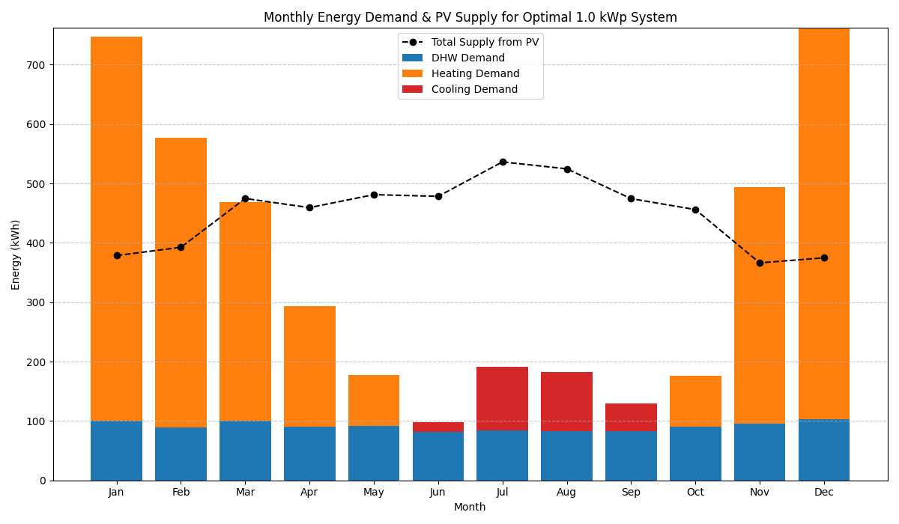
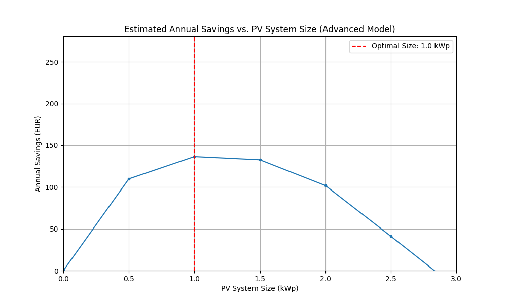

# Hybrid Energy System Optimization: PV + Biomass

This report details the analysis and optimization of a hybrid energy system combining a solar photovoltaic (PV) installation with a biomass boiler. The goal is to find the optimal PV system size that minimizes the total annual energy cost for a facility with significant heating, domestic hot water (DHW), and cooling needs.

---

## 1. Monthly Energy Data

The following table outlines the monthly energy profile for the facility, including the thermal demand (Heating and DHW), cooling demand, and the site-specific solar resource.

| Month | Heating Demand (kWh) | DHW Demand (kWh) | Cooling Demand (kWh) | Solar Irradiation (kWh/m²/mo) | PV Generation (kWh/kWp/mo) |
|:---   |---:|---:|---:|---:|---:|
| Jan   | 647.0 | 100.5 | 0.0 | 126.74 | 108.17 |
| Feb   | 487.0 | 89.5  | 0.0 | 132.68 | 112.17 |
| Mar   | 368.5 | 99.9  | 0.0 | 163.68 | 135.63 |
| Apr   | 202.3 | 90.5  | 0.0 | 162.94 | 131.25 |
| May   | 86.0  | 91.1  | 0.0 | 174.08 | 137.49 |
| Jun   | 0.0   | 81.3  | 16.4 | 178.35 | 136.68 |
| Jul   | 0.0   | 83.7  | 108.2 | 203.97 | 153.24 |
| Aug   | 0.0   | 83.3  | 99.3 | 198.07 | 149.91 |
| Sep   | 0.0   | 83.4  | 46.6 | 174.07 | 135.56 |
| Oct   | 86.0  | 90.8  | 0.0 | 162.10 | 130.30 |
| Nov   | 398.3 | 95.1  | 0.0 | 124.49 | 104.66 |
| Dec   | 658.9 | 103.0 | 0.0 | 126.10 | 107.09 |
| **Total** | **2,934.0** | **1,091.6** | **270.5** | | **1,542.15** |

*Note: PV Generation (`E_m`) is the estimated monthly electricity output for a 1 kWp system, accounting for panel efficiency and system losses.*

---

## 2. System Parameters & Assumptions

The optimization was based on the following technical and financial parameters.

### System Hardware & Performance
| Parameter | Value | Description |
|:---|:---|:---|
| **PV Panel Inclination** | 45° | Tilt angle of the solar panels. |
| **PV Panel Azimuth** | 180° | Panels are facing South for optimal yield in the Northern Hemisphere. |
| **Heat Pump COP** | 3.5 | A Coefficient of Performance of 3.5 is assumed for converting electricity to heat. |
| **Air Conditioner EER** | 3.5 | An Energy Efficiency Ratio of 3.5 is assumed for converting electricity to cooling. |

### Economic & Cost Factors
| Parameter | Value | Description |
|:---|:---|:---|
| **Installed PV System Cost** | €1,500 / kWp | All-in cost including panels, inverter, mounting, and labor. |
| **Biomass Pellet Price** | €0.09 / kWh | Cost of thermal energy generated by the biomass boiler. |
| **Grid Electricity Import Price** | €0.16 / kWh | Average price to buy electricity from the grid. |
| **Grid Electricity Export Price** | €0.02 / kWh | Price received for selling surplus PV electricity to the grid. |
| **Loan Interest Rate** | 6.0% | Annual interest rate for financing the PV system. |
| **Loan Term** | 15 years | The period over which the PV system investment is annualized. |

---

## 3. Energy Cascade Logic & Optimization

To find the most cost-effective solution, an optimization was performed. The model simulates different PV system sizes and calculates the total annual energy cost for each. The simulation uses a "cascade" logic to allocate the generated solar electricity in the most valuable way.

The monthly process for the model is as follows:

1.  **PV Generation:** The total electricity generated by the PV system is calculated for the month.
2.  **Meet Cooling Demand:** The generated electricity is first used to power the air conditioning system to meet the cooling demand. If the PV generation is insufficient, the model will buy the remaining electricity from the grid at the import price.
3.  **Meet Heating & DHW Demand:** Any electricity remaining after cooling is used to power the heat pump to satisfy the heating and DHW demand.
4.  **Activate Biomass Boiler:** If the PV-powered heat pump cannot cover the entire heating and DHW demand, the biomass boiler is activated to provide the remaining thermal energy.
5.  **Sell Surplus Electricity:** If any surplus electricity is left after all heating and cooling demands have been met, it is sold to the grid at the export price, generating revenue.

The **optimization goal** is to find the PV system size where the sum of all these costs (annualized PV investment + biomass fuel + grid imports) minus the revenue from grid exports is at its lowest point. This represents the most economically advantageous configuration over the long term.

The results of this optimization are presented in the generated charts, which identify the optimal system size and visualize the corresponding energy flows.

---
[N-Type-TOPCon-500W-Tensite.pdf](../manuals/N-Type-TOPCon-500W-Tensite.pdf)

## 4. Validation of Selected Hardware

The optimization identified an ideal system size of **1.0 kWp**. This can be perfectly implemented using **two (2) N-Type TOPCon 500W Tensite solar panels**. The technical specifications for this specific panel were reviewed to validate the performance assumptions made in the simulation.

### Panel Technical Data (STC)
| Parameter | Value |
|:---|:---|
| **Maximum Power (Pmax)** | 500W (±3%) |
| **Module Efficiency** | 22.25% |
| **Temp. Coefficient (Pmax)** | **-0.30% / °C** |

### Analysis & Conclusion

The most critical parameter for real-world performance is the **Temperature Coefficient of Pmax**. The selected panel has a coefficient of **-0.30% / °C**, which is significantly better than the industry average for conventional panels (approx. -0.40% / °C).

The PVGIS simulation used to estimate energy generation assumed a total system loss of **14%**. This is a standard, conservative figure that accounts for all sources of real-world inefficiency, with temperature-related losses being the largest component.

Given the superior heat resistance of the selected N-Type TOPCon panels, their actual total system losses will likely be closer to **10-12%**.

**Verdict:** The 14% loss assumption in our model is conservative. The chosen hardware is of high quality and will likely perform **better** than the simulation predicts. This provides a high degree of confidence that the calculated energy generation and financial savings are a realistic and achievable target.
